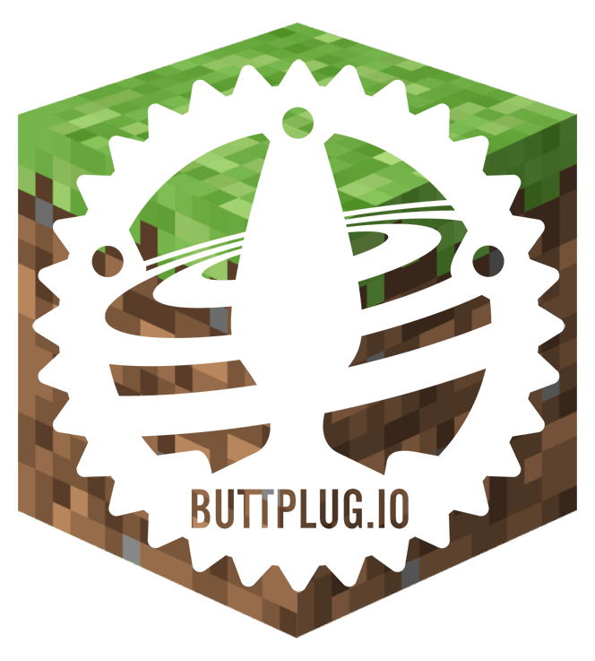
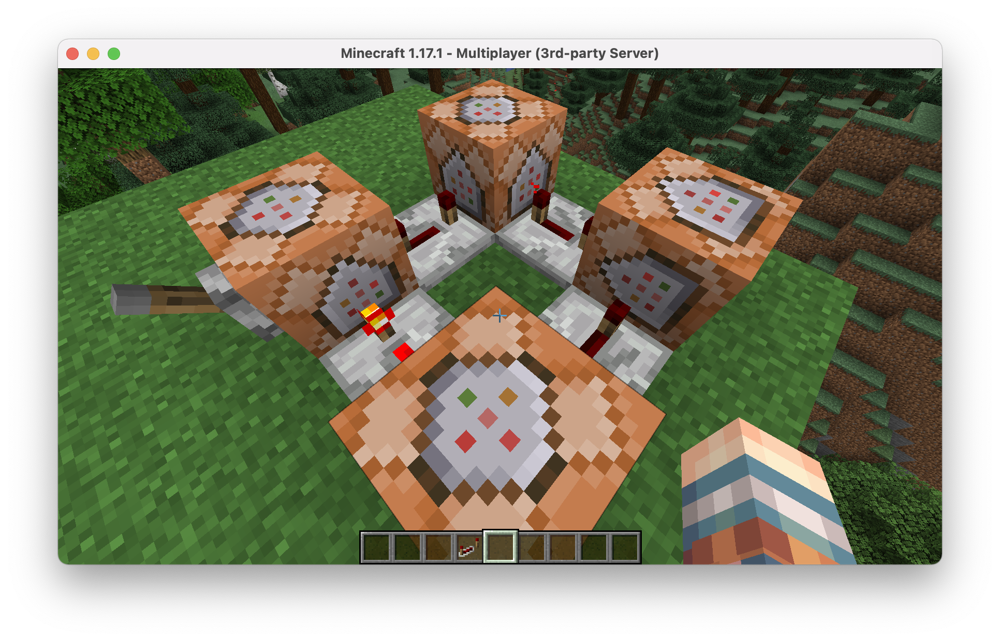

# ButtplugMC

_Mining blocks and stroking cocks!_



This Spigot (butt)plugin allows you (or anyone else, if you choose) to control your sex toys from within Minecraft!

We accept [Pull Requests](/pulls)!

## Table of Contents

- [How to build](#how-to-build)
- [How to use it](#how-to-use-it)
- [Commands](#commands)
- [Event listeners](#event-listeners)
- [Redstone](#redstone)

# How to build

This plugin uses buttplug.io to to talk to your toys. But because there isn't a central maven repository for the java library (at the time of writing) we will have to clone it...

```
git clone https://github.com/buttplugio/buttplug-rs-ffi
cd buttplug-rs-ffi/java
```

...and build it ourselves.

If you get any errors, feel free to create an [Issue](/issues), or ask for help in `#questions-and-support` in the official [Buttplug.io Discord](https://discord.buttplug.io).

```
./gradlew build
```

Finally we have to install the jar in a local Maven repository, so we can actually use it in our plugin.

I assume you have Maven installed as it seems to be pretty standard in Minecraft plugin scene. I might look into adding gradle one day. Or make a [Pull Request](/pulls)!

```
mvn install:install-file \
  -Dfile=lib/build/libs/lib-0.0.1.jar \
  -DgroupId=io.buttplug \
  -DartifactId=buttplug \
  -Dversion=0.0.1 \
  -Dpackaging=jar \
  -DgeneratePom=true
```

This is so we can use it as a dependency in our `pom.xml`.

Once you've done the above, you can now build this plugin.

```
cd buttplug-mc
mvn package
```

Installing the plugin into a server is now as simple as copying the built jar at `target/ButtplugMc-0.0.1.jar` to your servers `plugins` folder.

```
mv target/ButtplugMc-0.0.1.jar $MINECRAFT_SERVER_PATH/plugins
```

# How to use it

Once you have installed the plugin you will need to run [Intiface](https://intiface.com/desktop/) on your computer. This is the server which will actually communicate with your toys, usually via bluetooth. This plugin simply sends commands to the Intiface server. I personally use the [CLI version](https://github.com/intiface/intiface-cli-rs), because I prefer terminally things.

Now, you should be able to turn on your toy, and start the server.

```
java -Xmx1024M -Xmms1024M -jar spigot.jar nogui
```

Now log in, and try running `/add-toy`.

You should see a log saying something like:

```
[ButtplugMC] Enabling ButtplugMC...
[ButtplugMC] searching for toys...
[ButtplugMC] searching for toys...
[ButtplugMC] found device: Sexy Toy 9000
[ButtplugMC] ButtplugMC is enabled.
```

It might take a few seconds to find the toy.

If it doesn't find a toy, try:

- restarting the server
- restarting Intiface
- turning the toy off and on again

If it still doesn't work, feel free to file an Issue.

# Commands

- `/add-toy` - Connect your toy to an Intiface server and search for a single vibrate-based toy.
- `/vibrate [strength=0-100]` - Manually vibrate your toy

# Event listeners

- Mine a block and the toy will vibrate (configurable)
- Take damage and they toy will vibrate (configurable)

# Redstone

You can even control your toys with Redstone!

Type the following into a Command Block and give it a redstone signal and your toy should vibrate!

`execute as PLAYER_NAME run vibrate 100`

The following simple build alternates between `execute as PLAYER_NAME run vibrate 100` and `execute as PLAYER_NAME run vibrate 0` to make the toy turn off and on again every 0.4 seconds.


