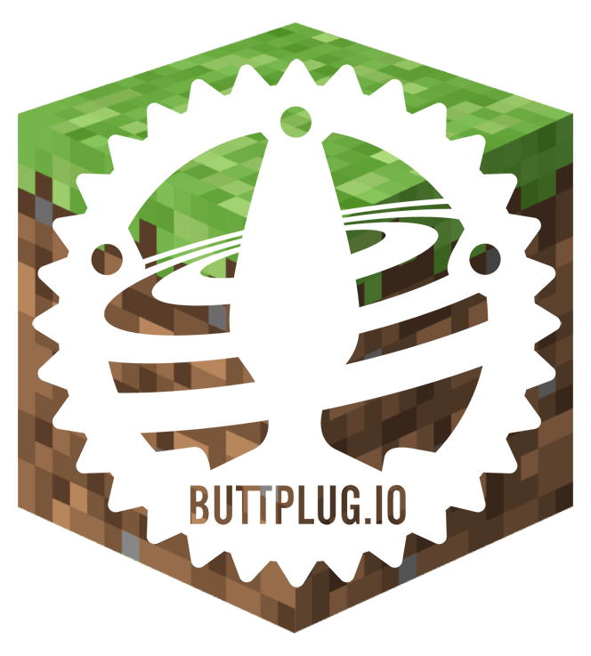

# ButtplugMC

_Mining blocks and stroking cocks!_



This Spigot (butt)plugin allows you (or anyone else, if you choose) to control your sex toys from within Minecraft!

We accept [Pull Requests](/pulls)!

# How to build

This plugin uses buttplug.io to to talk to your toys. But because there isn't a central maven repository for the java library (at the time of writing) we will have to clone it...

```
git clone https://github.com/buttplugio/buttplug-rs-ffi
cd buttplug-rs-ffi/java
```

...and build it ourselves.

If you get any errors, feel free to create an [Issue](/issues), or ask for help in `#questions-and-support` in the official [Buttplug.io Discord](https://discord.buttplug.io).

```
./gradlew build
```

Finally we have to install the jar in a local Maven repository, so we can actually use it in our plugin.

I assume you have Maven installed as it seems to be pretty standard in Minecraft plugin scene. I might look into adding gradle one day. Or make a [Pull Request](/pulls)!

```
mvn install:install-file \
  -Dfile=lib/build/libs/lib-0.0.1.jar \
  -DgroupId=io.buttplug \
  -DartifactId=buttplug \
  -Dversion=0.0.1 \
  -Dpackaging=jar \
  -DgeneratePom=true
```

This is so we can use it as a dependency in our `pom.xml`.

Once you've done the above, you can now build this plugin.

```
cd buttplug-mc
mvn package
```

Installing the plugin into a server is now as simple as copying the built jar at `target/ButtplugMc-0.0.1.jar` to your servers `plugins` folder.

```
mv target/ButtplugMc-0.0.1.jar $MINECRAFT_SERVER_PATH/plugins
```
